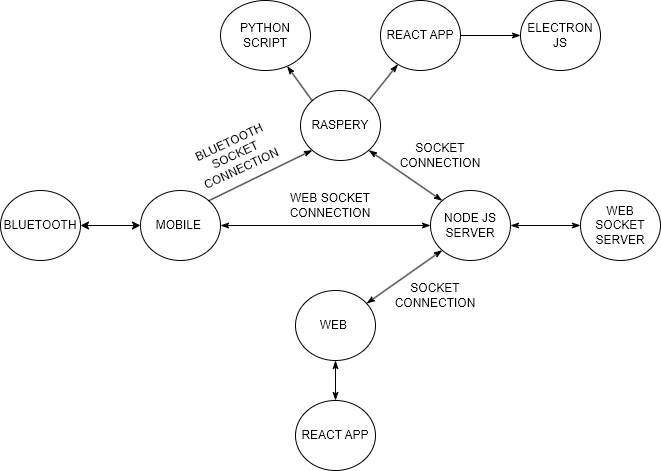
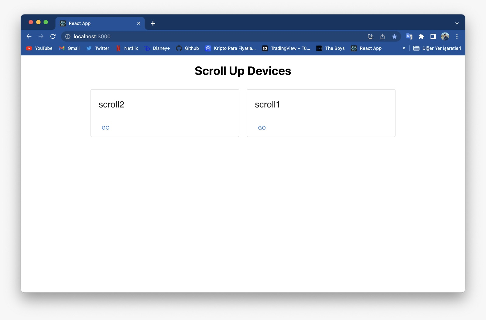
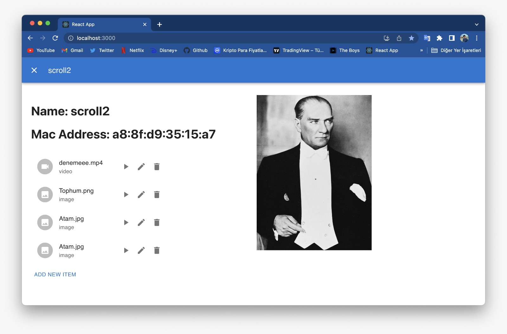
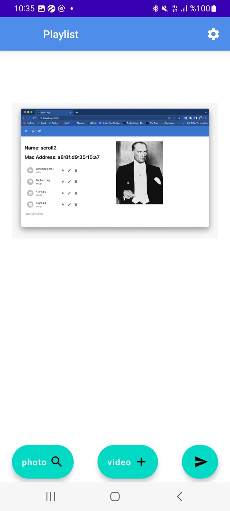
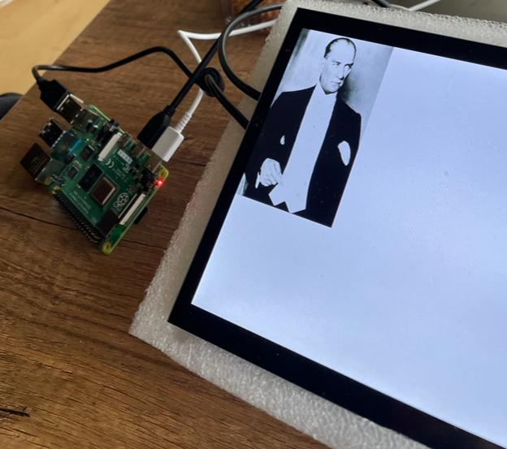

# HACKHATHON 2023 INIFIA - SCROLL UP

## Geliştirme Modeli

  </img>

## Geliştirilmiş Uygulamalar
- React Web Server
- React Web Application
- Python Script Code - Raspberry pi
- Android Application
- Electron JS - Raspberry pi

## Uygulamaların Özellikleri

### React Web Server - React Web Application
- Tüm cihazların yönetimi buradan gerçekleştirilir.
- Web Soket aracılığıyla cihazlar arası iletişimin sağlamasında merkez rolünü üstlenir.
- Cihazlarların playlistleri burada gösterilir ve yönetilir.
- Cihazlar arası stream yapar. Aynı anda iki resmin veya videonun farklı cihazlarda senkronize olarak oynatılmasıdır.

### Electron JS
- Gelen resim veya videolar bu uygulama sayesinde raspberry pi üzerinde gösterilir.
- Verilerin gösterimi burada gerçekleşir.

### Mobil
- Çevredeki scroll up raspberry pi cihazlar fitrelenerek kullanıcıya gösterilir.
- Gösterilen cihazlarla kullanıcı bluetooth bağlantısı kurar.
- Kurulmuş bluetooth bağlantısı ıle bağlantı kurulmul raspberry pi arasıbda soket oluşturulur.
- Kullanıcı göndermek istediği fotoğrafı seçer.
- Seçilen fotoğraf BASE64'e decode edilir.
- Decode edilmiş BASE64 stringi bluetooth bağlantısı üzerinden raspberry pi'a gönderilir.

### Python Script Code - Raspberry pi
- Raspberry pi etraftan gelecek fotoğraf BASE64 kodunu bekler.
- Gelen veri kendi formatımızda bölünerek, JSON dosyasina dönüştürülür.
- JSON dosyası okunarak fotoğrafa çevrilir.
- Fotoğraf Raspberry pi üzerinde gösterilir.

## WEB Sayfalari

  </img>
  </img>

## Mobil

  </img>
  </img>
  </img>

## Raspberry pi

  </img>

## KULLANILAN TEKNOLOJİLER

  
  
  
  
  
  
  
  
  

